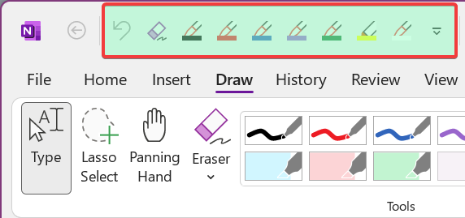

## [Huion HS611](https://www.huion.com/pen_tablet/HS/huion-hs611.html) configs

**Default.xml** is pretty much self-explanatory - these are just standard settings.

**Custom.xml:**

- [OneNote 2021](https://www.microsoft.com/pl-pl/microsoft-365) *(don't confuse with OneNote for Windows 10)* (full support)
- [Krita](https://krita.org/en/) (limited support)
- [Drawboard PDF](https://www.drawboard.com/pdf) (limited support)

For this configuration to work, OneNote 2021 language must be set to English and Quick Access Toolbar must look as shown on the image below (there is another config for that in the `Windows/OneNote 2021` folder). 

